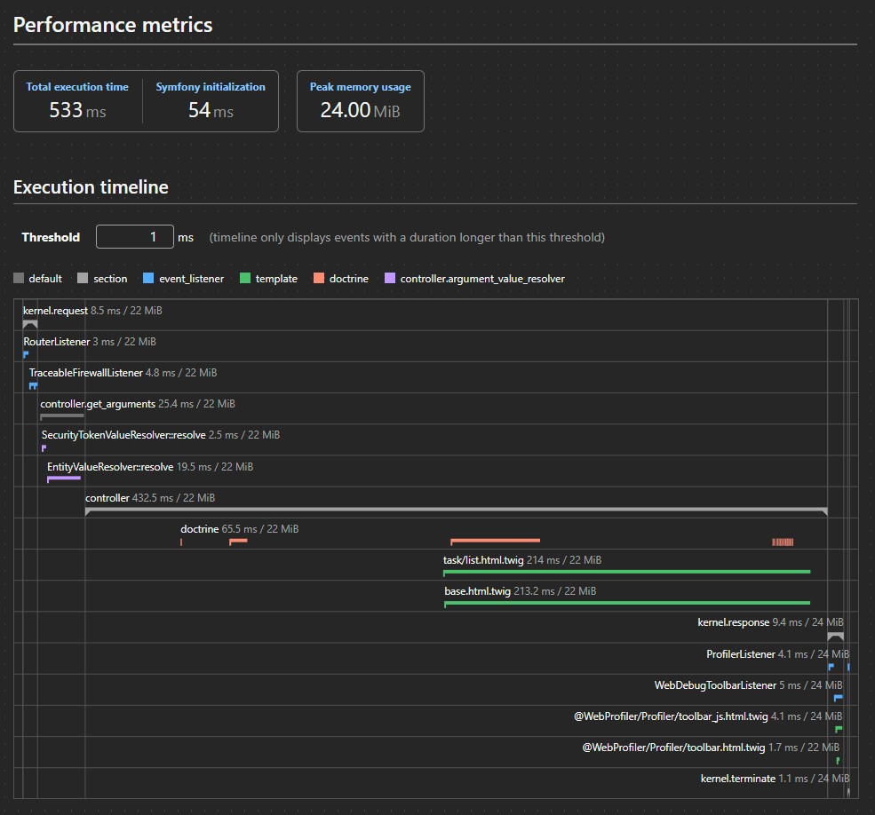

# Comment réduire la dette technique de l'application

Comme vu dans le rapport du profiler de la page des tâches : 

Nous pouvons observer que le rendu de la page est ce qu'il prend le plus de temps. Cela ne va pas s'arranger à mesure que le nombre de tâches grandira. Plusieurs solutions sont possibles pour garder un site fluide dans le temps :

- Il est possible de créer une pagination des tâches afin de ne pas afficher tout sur une même page mais plutôt de n'en avoir qu'une partie et ainsi garder un temps de chargement constant entre les pages. Pour cette pagination nous avons plusieurs méthodes :
  - pagination : Le système le plus classique avec des boutons qui permettent de choisir à quelle page on veut aller et de pouvoir se balader entre les pages précédentes et suivantes.
  - infinite-scrolling : Une page qui ne se finie pas, dès que l'on atteint le bas de la page, la suite des tâches est affichée. Cela permet de tout garder sur une seule page si l'on veut faire des `ctrl + F` afin de recehrcher une information (même si des barres de recherches peuvent être développées)
- Passer en ajax réduira aussi le temps de chargement de la page car la page pourras s'afficher sans que les tâches soient chargées car celle-ci seront chargées en arrière plan ce qui permet au moins d'avoir un résultat visuel et non pas une page blanche qui charge. C'est un bon avantage côté UX.
